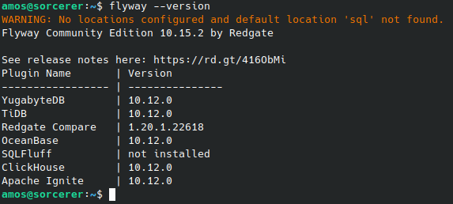
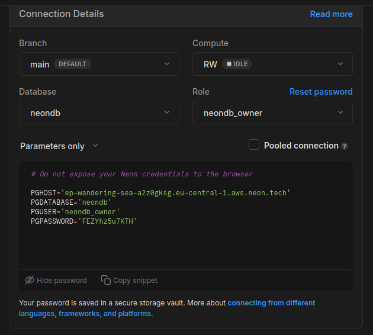
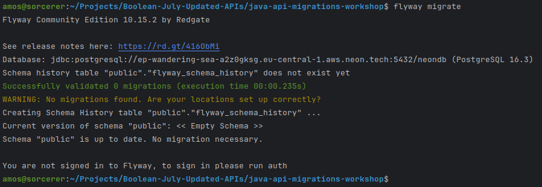
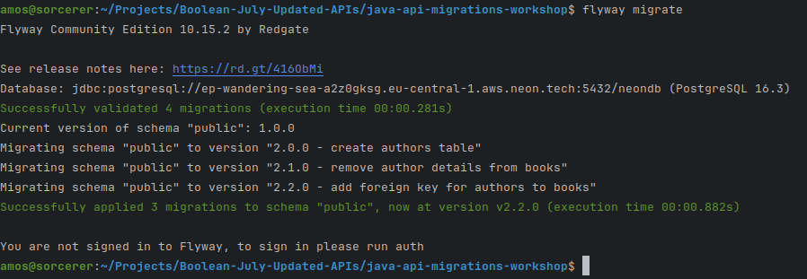
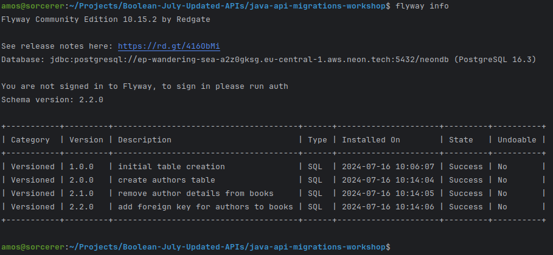
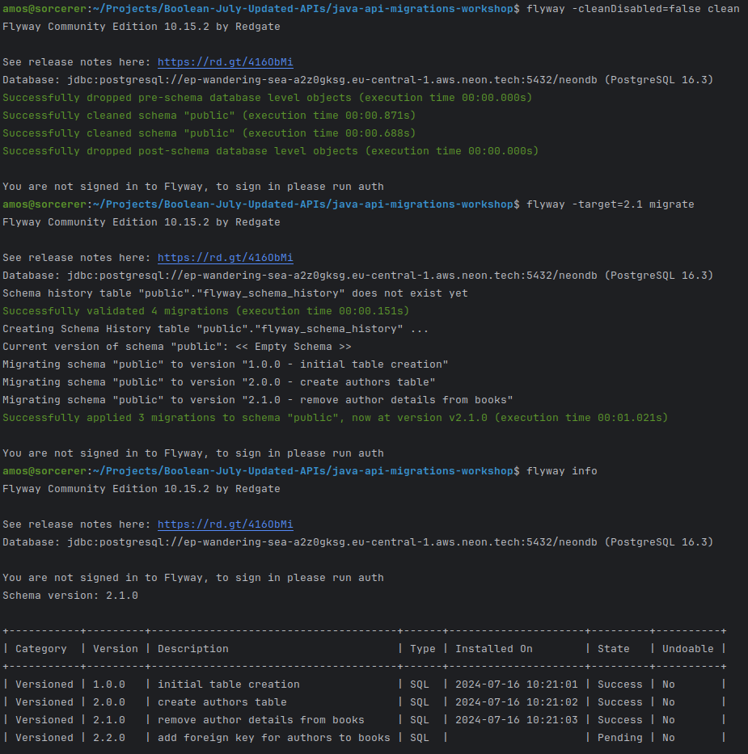

# Java Migrations Workshop

## Instructions

1. Fork this repository
2. Clone your fork to your machine
3. Open the project in IntelliJ (although we aren't doing any Java in this activity it does allow you to edit SQL).

### Learning Objectives

---

- Understand that database migrations are a way to control incremental changes to a database schema
- Understand that database migrations offer protection against destructive operations
- Understand that you can version control them as well as keep a log of the migrations so that it is possible to see a complete history of all of the various versions of your database
- Understand that it is also possible to integrate database migrations directly into your Java code so that it runs from there rather than as a separate  application


## Main

---

We will work on this using a tool called Flyway that can be run from the command line and talks to the database to create and update its structure.


### Installation

---

Go to [https://documentation.red-gate.com/fd/command-line-184127404.html](https://documentation.red-gate.com/fd/command-line-184127404.html) find the Community Edition download for your Operating System and download it.

Unzip the download into a folder where you want it to be installed/remain for the time you will be using it (you probably want to move it out of the Downloads folder, but where you put it is up to you).

In order to make the flyway application available to you from the command line you will probably need to add it to the PATH in some way (this depends on your Operating System). Once you have done that you will normally need to restart the Terminal that you are using for the change to be picked up.

Once you’ve done that, type **flyway** at the command prompt and press enter. If it has been picked up then it should show all of the available options for when flyway is run.

Running **flyway —version** should show the version of flyway you have just installed.



### Connecting to the Database

---

In the previous session, you created a database and tables on Neon which you used Beekeeper Studio to connect to (using the connection details from Neon).

Flyway has various places it looks for a config file, which will hold the details of the database connection (in this order):

- `<install-dir>/conf/flyway.conf`
- `<user-home>/flyway.conf`
- `<current-dir>/flyway.conf`

If you put `flyway.toml` into your current directory it is very, very, very important that you **DO NOT** commit this to GitHub, as anyone with access to your repo could then use the credentials to access your Database. There are bots constantly scanning GitHub to steal these sorts of information in order to use them for potentially nefarious purposes.

You can use **.gitignore** to exclude this file from Git.

For now, you can use the one in your installation directory/conf and then change it if you need to connect to a different Database (that way it is outside of the Git repository directory).

Go to the **conf** directory which is inside **flyway**'s installation directory. Copy the `flyway.toml.example` file and paste a new copy with the updated name of just `flyway.toml`. Open the new file and you should see that some of it is commented out and some has default values.

```toml
# More information on the parameters can be found here: https://documentation.red-gate.com/flyway/flyway-cli-and-api/configuration/parameters

[environments.sample]
url = "jdbc:h2:mem:db"
user = "sample user"
password = "sample password"
# jarDirs = ["path/to/java/migrations"]
# driver =
# schemas =
# connectRetries =
# connectRetriesInterval =
# initSql =
# jdbcProperties =
# resolvers =

[flyway]
# environment = "sample" # It is recommended to configure environment as a commandline argument. This allows using different environments depending on the caller.
# locations = ["filesystem:path/to/sql/files"]

# [environments.build]
# url = "jdbc:sqlite::memory:"
# user = "buildUser"
# password = "buildPassword"

# [flyway.check]
# buildEnvironment = "build"
```

Now go to your Neon Dashboard and find the Connection Details, they should look something like this:



Take the values listed there and use them to populate your `flyway.toml` file as follows. Also change the name of the connection section from `sample` to something else relevant and uncomment the `environment` part adding the name of the connection sample as shown. It should look something like this (the connection details have already been changed in my Neon account):

```toml
# More information on the parameters can be found here: https://documentation.red-gate.com/flyway/flyway-cli-and-api/configuration/parameters

[environments.neon]
url = "jdbc:postgresql://ep-wandering-sea-a2z0gksg.eu-central-1.aws.neon.tech:5432/neondb"
user = "neondb_owner"
password = "FEZYhz5u7KTH"
# jarDirs = ["path/to/java/migrations"]
# driver =
# schemas =
# connectRetries =
# connectRetriesInterval =
# initSql =
# jdbcProperties =
# resolvers =

[flyway]
environment = "neon" # It is recommended to configure environment as a commandline argument. This allows using different environments depending on the caller.
locations = ["db/migrations"]

# [environments.build]
# url = "jdbc:sqlite::memory:"
# user = "buildUser"
# password = "buildPassword"

# [flyway.check]
# buildEnvironment = "build"
```

We've also added a location `db/migrations`, which flyway will check for migration files to use. The way it is set up, even though the config file is elsewhere, when we run the following command from the top level of our project (ie we run the command in the terminal in IntelliJ) flyway will look for a folder called `db` containing another folder called `migrations` and use that location. If you make sure you have that all set up and then run the following command:

**flyway migrate**

If all is well you should see something that looks like:



It may include an error or warning that the database isn't empty, but we'll fix that next.

### Using Flyway to Create and Update a Database

---

Think about the Book database you started with yesterday.

First of all use Beekeeper Studio to go into the Neon database that was created yesterday and remove all of the tables using **drop table <name-of-table>** replacing <name-of-table> with the names of each table to remove. You can then run `flyway migrate` again if you wish to check that everything is now cleared.

Next we are going to create a Books database, if we had it as a single monolithic table, the structure would look something like:

Books

**id**, title, author, publisher, year, genre, score, author_email, publisher_location

We’re going to use Flyway to create this table in our database.

The query we would use to do this looks like this:

```sql
CREATE TABLE IF NOT EXISTS Books(
	id SERIAL PRIMARY KEY,
	title TEXT NOT NULL,
	author TEXT,
	publisher TEXT,
	year INT,
	genre TEXT,
	score INT,
	author_email TEXT,
	publisher_location TEXT
);
```

Rather than run it in Beekeeper Studio we are going to use flyway to iterate through creating and then changing (ie Migrating) the database until we get to a final version that matches what we want.

In the **db/migrations** folder in the repo create a new file called **V1_0_0__initial_table_creation.sql** and paste the above code to create the SQL table in it.

The name of the file is very important, it starts with a capital V, which can be changed somewhere in the config file, it is then followed by 1_0_0 which corresponds to the version of the database, subsequent files will need to follow on from this number, this is followed by a double underscore and then a description for what the file does (this bit is for you rather than the computer).

To run the file make sure you are in the top-level directory of the project in your terminal and type **flyway migrate** followed by enter. You should see something like this:


In Beekeeper Studio look at the tables in the database, there should be a **Books** one which matches the one defined in our file. There will also be a second table called something like `flyway_schema_history` which is part of the way that flyway tracks the tables.

Next, we want to modify the table we just created, we’re going to remove the author and author email columns from the Books table and replace them with a Foreign Key that points to the author in the new Authors table which we’re also going to be creating. We can put all of these changes into a single file, or we can put them into separate ones which are executed in order according to the numbering system which we use.

Add a file called **V2_0_0__create_authors_table.sql** and add a create table statement to it as follows.

```sql
 CREATE TABLE IF NOT EXISTS Authors (
    id SERIAL PRIMARY KEY,
    name TEXT,
    email TEXT
);
```

Which will create the new table. Then add another file called **V2_1_0__remove_author_details_from_books.sql** with the following SQL inside it.

```sql
ALTER TABLE Books
DROP COLUMN author,
DROP COLUMN author_email;
```

If there is any data in the Books table this will destroy the contents of these columns. In general, you will be working on a Development database with dummy data and this won’t matter as you would then recreate the data.

[**NOTE:** If you need to preserve the data and then write it to the new table preserving the relationships then you would need to create the new column (see next file), step through the records, capture the data, add it to the new table, get the new id, add it back into the Books table in the new column so that the existing author details now match the ID from the Authors table, and then remove the two columns. This can all be done in SQL, but for a production database with millions of lines of data it can be extremely non-trivial to do.]

Add yet another file called **V2_2_0__add_foreign_key_for_authors_to_books.sql** with the following SQL.

```sql
ALTER TABLE Books
ADD COLUMN author_id INT;

ALTER TABLE Books
ADD CONSTRAINT fk_author_id FOREIGN KEY (author_id) REFERENCES Authors (id);
```

When adding the new column we need to make sure to specify what data type it has (the int in this case) as well as the name.

Foreign key constraints need to have a name and then we specify that the **author_id** column in Books is a reference to the **id** column (in brackets) of the **Authors** table.

To update the existing database with all of these changes we can just run **flyway migrate** again and it will look to see what the current version of the database is at and then apply the subsequent changes.



If you want to see the current details of where the database migrations are up to we can do **flyway info** to get some details back.



In the table you can see the 4 versioned files that have been added and the time stamps for when they were run.

If we want to remove all of the tables from the database because we made a mistake or want to start with a blank slate we can run: **flyway -cleanDisabled=false clean** which will remove all of the tables etc created by the migrations. We have to specify **-cleanDisabled=false** as this option is set to true by default. We could also find this option in the config file and set it to true there so that we don’t have to add this every time.

If we had a paid for version of **flyway** then at some tiers there is an extra command **flyway undo** which will remove the last migration that was applied which could be useful if we want to remove the final step. This is not available in the free version we are using. You can achieve the same effect by cleaning all of the migrations and then using target to only run them up to a certain point. So to get to the stage where the final migration has not been applied we would need to remove everything and then only apply the migrations up to a certain point we could do

**flyway -cleanDisabled=false clean**

**flyway -target=2.1 migrate**

This would clear everything out and then apply the migrations up to and including the **V2_1_0…** file but not including the **V2_2_0…** one.



Looking at the output from **flyway info** you can see that it sees the final migration but doesn’t apply it.

Rerun **flyway migrate** and it will apply the final one.

Next, we’re going to do something similar to remove the publisher and publisher_location columns from the **Books** table, make a new table called **Publishers** with those columns and an id column in it and update **Books** to have a Foreign Key called publisher_id (in other words the same steps we did with the author).

Try and work through these steps to create files with Version numbers V3_0_0…, V3_1_0… and V3_2_0… the descriptions in the name are for your information about what the files do. Then look below to see the results.

### Example Solutions

**V3_0_0__create_publishers_table.sql**

```sql
CREATE TABLE IF NOT EXISTS Publishers (
    id SERIAL PRIMARY KEY,
    name TEXT,
    location TEXT
);
```

**V3_1_0__remove_publisher_details_from_books.sql**

```sql
ALTER TABLE Books
DROP COLUMN publisher,
DROP COLUMN publisher_location;
```

**V3_2_0__add_foriegn_key_for_publishers_to_books.sql**

```sql
ALTER TABLE Books
ADD COLUMN publisher_id INT;

ALTER TABLE Books
ADD CONSTRAINT fk_publisher_id FOREIGN KEY (publisher_id) REFERENCES Publishers (id);
```
## Activity

Either change the location of the db migrations location in the config file, or move the existing migrations out of the **db/migrations** folder before starting this activity, and place the files to perform this migration in there.

Imagine you have a similar data structure for bands and their albums. Start by creating an Albums table which has the following columns (come up with your own logical names and data types for them):

- id
- name
- year of release
- highest chart position
- artist/band name
- number of members in the act
- artist/band year founded
- record company name
- record company location
- record company year founded

Create an initial migration file that will create a single monolithic table containing all of these columns.

Create migration files to separate the table structure into more logical (ie normalised) tables and use flyway to test that the migrations work properly.

## Assessment

For the afternoon task you will be following a similar route, begin by creating the monolithic table described and then add the files to modify the tables until you end up with a nicely normalised database structure. 

Full details can be found in the repository (remember to Fork and Clone it).

[Afternoon Activity](https://github.com/boolean-uk/java-api-migrations)
